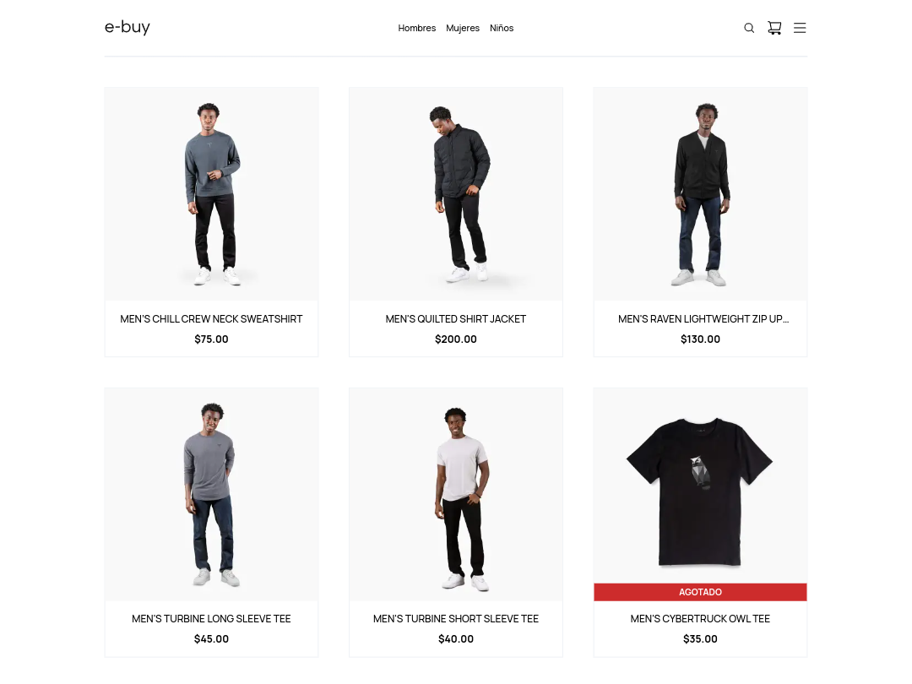

# 🤖 E-Buy E-commerce

Una tienda con productos de ropa creada con NextJs usando Static site generation, Next API, Next Middelwares, TypeScript, Tailwind y Mongoose para persistir la información en una base de datos de MongoDB.

[Puedes ver el sitio en línea aquí](https://audiophile-next.netlify.app/)

## 🖼️ Screenshots



## 🚀 ¿Como usar?

Primero clona el repositorio desde GitHub.

```shell
git clone https://github.com/joseluria/e-buy.git
```

Muévete a la carpeta del proyecto.

```shell
cd e-buy
```

Instala las dependencias con el siguiente comando:

```shell
npm install
```

Por último, inicia el servidor con el siguiente comando:

```shell
npm run dev
```

## 💾 Configurando la base de datos con Docker (Opcional)

_Para realizar este paso es obligatorio tener [Docker](https://www.docker.com/products/docker-desktop/) instalado, de igual forma puedes usar tu propia base de datos local o de MongoDB Atlas._

Debes usar el siguiente comando para levantar una base de datos de forma local con el archivo **docker-compose.yml**:

```shell
docker-compose up -d
```

La base de datos se iniciara en el puerto _27017_ y la información de la base de datos se almacenara en la carpeta **mongo**.

El string de conexión ya está incluido en el archivo **.env.example** y se ve así:

```text
MONGO_URL=mongodb://localhost:27017/ebuydb
```

🚨 Puedes abrir el archivo **.env.example** para ver un ejemplo con todas las variables de entorno, recuerda que debes crear tu propio archivo **.env** con tus varibles de entorno.

## 💽 Usando la API para crear los datos de los productos y categorías

Next JS te permite crear una API en la aplicación para de esta manera tener el Frontend y Backend en el mismo lugar, para crear los datos con la información de los productos y categorías puedes usar el siguiente enpoint usando una petición _POST_:

🚨 Esta funcionalidad solo sirve en el entorno de desarrollo.

```shell
http://localhost:3000/api/seed
```

En el archivo **data.ts** en la carpeta **db** puedes encontrar el arreglo con todos los datos de los productos y usuarios.

## ⚙️ Esta aplicación fue construida usando las siguientes tecnologías

- [Next Js](https://nextjs.org/)
- [TypeScript](https://www.typescriptlang.org/)
- [Tailwind](https://tailwindcss.com/)
- [Framer Motion](https://www.framer.com/docs/animation/)
- [Redux Toolkit](https://redux-toolkit.js.org/)
- [Next Auth](https://next-auth.js.org/)
- [SWR](https://swr.vercel.app/)
- [PayPal Buttons](https://www.npmjs.com/package/@paypal/react-paypal-js)
- [Axios](https://axios-http.com/docs/intro)
- [Bcryptjs](https://www.npmjs.com/package/bcryptjs)
- [Cloudinary](https://cloudinary.com/)
- [React Toastify](https://fkhadra.github.io/react-toastify/introduction)
- [Yup](https://github.com/jquense/yup)
- [MongoDB](https://www.mongodb.com/)

## 📄 Licencia

[MIT](https://opensource.org/licenses/MIT)
